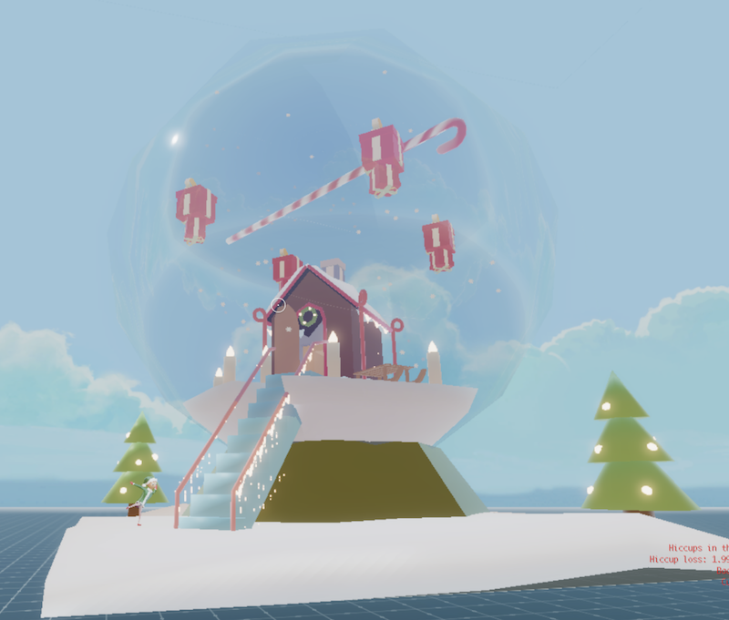

# Tourniquette  
  
*Tourniquette is a multiplayer platform game in [Decentraland](https://decentraland.org/)*

## What's in the game

**The Tourniquette** is a 1x1 scene containing a snowball themed for Xmas. 

Visitors can play a 4-player platform game where they need to be the last man standing on a platform, by avoiding a cane sugar rotating ever quickly ! For more challenge, players can reverse the rotation of the cane sugar and throw each other snowballs that will splash on their screens. 

## Play

The game is available at `-14,-120`

[Come to play with us !](https://play.decentraland.org/?position=-14,-120)

Or type in the chat:
`/goto -14,-120 `

## Game jam

The game has been submitted to the [Save Xmas Game Jam 2020](https://decentraland.org/blog/announcements/save-xmas/) event.

It implements a multiplayer game mechanism and a NPC !

## Credits

- @julesgoullee & @pakokrew : Software development
- @NinjaFire : 3D Models
- @inattendu : Sound design
